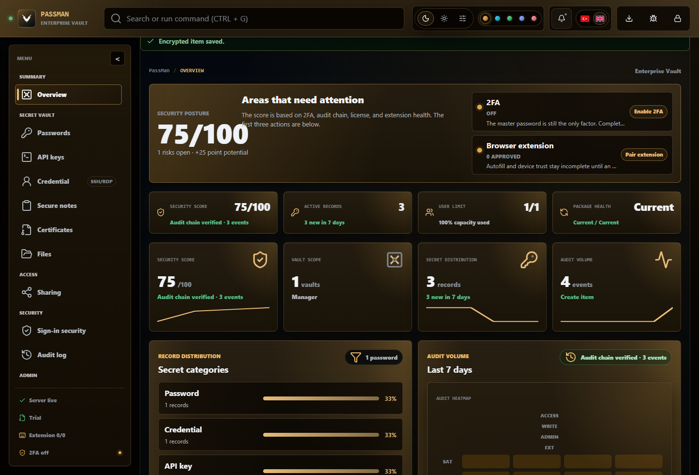
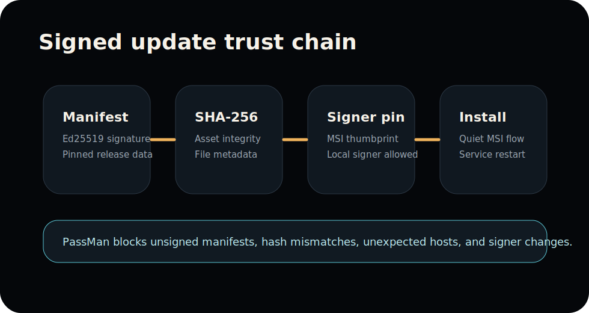

<h1 align="center"> VaultPilot Enterprise Vault Console</h1>

<p align="center">
  <strong>Public release hub, operator wiki, knowledge base and support boundary for the self-hosted VaultPilot password and secrets manager.</strong>
</p>

<p align="center">
  <strong>Languages:</strong>
  <a href="README.de.md">Deutsch</a> |
  <a href="README.es.md">Espa&#241;ol</a> |
  <a href="README.md">English</a> |
  <a href="README.pt-BR.md">Portugu&#234;s (Brasil)</a> |
  <a href="README.tr.md">T&#252;rk&#231;e</a> |
  <a href="README.fr.md">Fran&#231;ais</a>
</p>

<!-- bilingual-welcome:start -->
<table>
  <tr>
    <td width="50%" valign="top">
      <h3>English welcome</h3>
      <p>VaultPilot public docs is the release hub, operator wiki, knowledge base, support boundary, and trust surface for the self-hosted enterprise vault.</p>
      <p><strong>Start here:</strong> <a href="docs/en/README.md">English docs home</a> is the operator entry point.</p>
    </td>
    <td width="50%" valign="top">
      <h3>Türkçe karşılama</h3>
      <p>VaultPilot için public release ve dokümantasyon merkezi. Kurulum, operasyon, bilgi bankası, destek paketi ve güvenlik sınırları burada; private kaynak kod ve hassas operasyon verisi bu repoya girmez.</p>
      <p><strong>Buradan başla:</strong> Türkçe operasyon akışı <a href="docs/tr/README.md">docs/tr</a>; İngilizce ekipler için <a href="docs/en/README.md">docs/en</a>.</p>
    </td>
  </tr>
</table>
<!-- bilingual-welcome:end -->

<p align="center">
  <a href="https://github.com/ucsahinn/vaultpilot/releases/latest"> <strong>Latest Published Release</strong></a>
  |
  <a href="docs/en/README.md"> <strong>Docs EN</strong></a>
  |
  <a href="docs/tr/README.md"> <strong>Docs TR</strong></a>
  |
  <a href="kb/en/README.md"> <strong>KB EN</strong></a>
  |
  <a href="kb/tr/README.md"> <strong>KB TR</strong></a>
  |
  <a href="SECURITY.md"> <strong>Security</strong></a>
  |
  <a href="docs/en/public-repository-boundary.md"> <strong>Boundary</strong></a>
  |
  <a href="SUPPORT.md"> <strong>Support</strong></a>
  |
  <a href="CONTRIBUTING.md"><strong>Contributing</strong></a>
</p>

<p align="center">
  <a href="https://github.com/ucsahinn/vaultpilot/releases/latest"></a>
  <a href="docs/en/README.md"></a>
  <a href="README.md"></a>
  <a href="SECURITY.md"></a>
  <a href="SUPPORT.md"></a>
  
  
</p>

<p align="center">
  <strong>Current verified public release:</strong> VaultPilot Enterprise Vault Console 2.0.0, published as GitHub Release <a href="https://github.com/ucsahinn/vaultpilot/releases/tag/v2.0.0">v2.0.0</a> on June 30, 2026.
</p>

<p align="center">
  <code>VaultPilot 2.0.0</code>
  &nbsp;
  <code>Windows MSI</code>
  &nbsp;
  <code>TR + EN</code>
  &nbsp;
  <code>Self-hosted</code>
  &nbsp;
  <code>Source private</code>
</p>

<table>
  <tr>
    <td align="center" width="25%">
      <a href="https://github.com/ucsahinn/vaultpilot/releases/latest"><br><strong>Open latest published release</strong></a><br>
      <sub>Current public release: VaultPilot 2.0.0.</sub>
    </td>
    <td align="center" width="25%">
      <a href="docs/en/README.md"><br><strong>Read operator docs</strong></a><br>
      <sub>Install, verify, operate and recover.</sub>
    </td>
    <td align="center" width="25%">
      <a href="SECURITY.md"><br><strong>Check trust boundary</strong></a><br>
      <sub>Public scope, release trust and secret rules.</sub>
    </td>
    <td align="center" width="25%">
      <a href="SUPPORT.md"><br><strong>Prepare support evidence</strong></a><br>
      <sub>Redacted handoff without secrets.</sub>
    </td>
  </tr>
</table>

---

<p align="center">
  
</p>

<p align="center">
  <sub>Sanitized VaultPilot 2.0 screenshot captured from an isolated documentation runtime on July 9, 2026 with synthetic enterprise data only. It shows UI state only; release binaries stay in GitHub Releases and published asset hashes remain release evidence. Private source code, signing material and customer data stay out of this repository.</sub>
</p>

##  Enterprise Operating Contract

| Contract | How this repository enforces it |
| --- | --- |
|  Customer-safe public surface | Only docs, sanitized screenshots, release links, knowledge-base articles and public policies live here. |
|  Release assets outside git | MSI files, ZIP packages, manifests and support scripts are delivered through GitHub Releases or the Chrome Web Store. |
|  Operator-first navigation | Quickstart, runbooks, update checks, extension flows, AD agent setup and support evidence paths are linked from the first screen. |
|  TR/EN paired docs | Turkish and English operator docs are kept as paired routes; validation checks paired file presence and key public references before publication. |
|  Evidence without secrets | Support handoff asks for redacted context and blocks plaintext credentials, keys, databases, backups and customer data. |

##  Release Trust Path



| Signal | Trust signal | Public evidence |
| --- | --- | --- |
|  | Release assets stay out of git | MSI, release fallback ZIPs, manifest and agent script are linked from GitHub Releases only; browser extension installs use Chrome Web Store. |
|  | Update flow is manifest-led | VaultPilot verifies the signed manifest, release metadata, SHA-256 checksum and MSI signer before update execution. |
|  | Source boundary is explicit | This public repository contains docs, sanitized screenshots and release links; private product code and signing material are not published here. |
|  | Operator evidence is safe by default | Support paths ask for redacted evidence packs and forbid plaintext secrets, private keys, database files and customer data. |
|  | TR/EN docs stay paired | Validation checks paired Turkish and English file presence, required public references and local links before publication. |

##  Start Here

Use this repository as the public front desk for the supported VaultPilot application. It should answer the first operational question without exposing source code, secrets, signing material or customer data.

| Need | Primary route | Why it matters |
| --- | --- | --- |
| Download or verify the supported release | [Latest release](https://github.com/ucsahinn/vaultpilot/releases/latest), [release notes](RELEASES.md), [asset verification](docs/en/release-asset-verification.md) | Operators can verify the MSI, manifest, hashes, signer evidence and component assets before internal redistribution. |
| Install and operate VaultPilot | [Documentation gateway](docs/README.md), [EN docs](docs/en/README.md), [TR docs](docs/tr/README.md) | Full install, owner, HTTPS, Server System, Discovery, extension, AD, sharing, backup and update paths live in the wiki. |
| Open the right in-app `?` help | [Screen help index](docs/en/in-app-screen-help.md), [TR ekran yardımı](docs/tr/in-app-screen-help.md), [screen help target manifest](docs/screen-help-targets.json) | Every topbar help route maps to a dedicated EN/TR screen page with states, pre-action checks and safe evidence guidance. |
| Diagnose an incident | [Knowledge base](kb/README.md), [EN KB](kb/en/README.md), [TR KB](kb/tr/README.md) | Public-safe diagnosis paths stay grouped by symptom. |
| Prepare support evidence | [Support policy](SUPPORT.md), [EN evidence pack](docs/en/support-evidence-pack.md), [TR kanıt paketi](docs/tr/support-evidence-pack.md) | Evidence is useful without leaking secrets, logs, databases, certificates or customer data. |
| Understand the public boundary | [EN boundary](docs/en/public-repository-boundary.md), [TR boundary](docs/tr/public-repository-boundary.md), [public issue redaction](kb/en/public-issue-redaction.md) / [TR](kb/tr/public-issue-redaction.md) | Public issues and docs stay safe; private-source and licensed-support boundaries stay explicit. |
| Prepare publication safely | [Publication runbook](docs/en/publication-runbook.md), [TR yayın runbook'u](docs/tr/publication-runbook.md), [validation failure KB](kb/en/public-validation-fails.md) / [TR](kb/tr/public-validation-fails.md) | Working tree, staged tree, secrets, release assets and owner/account gates are checked before public changes move forward. |
| Maintain repo discoverability | [GitHub repository profile](docs/en/github-repository-profile.md), [discoverability](docs/en/public-discoverability.md), [llms.txt](llms.txt), [TR repo profili](docs/tr/github-repository-profile.md), [TR keşfedilebilirlik](docs/tr/public-discoverability.md), [language glossary](docs/en/public-language-glossary.md) / [TR](docs/tr/public-language-glossary.md) | Description, topics, social preview, search/AI index limits, issue intake, AI/LLM index hints and Turkish/English wording stay aligned. |

##  What This Repository Is

This is the public GitHub home for VaultPilot Enterprise Vault Console. VaultPilot is the current product name for new releases; PassMan remains a compatibility name for older installed services, data paths, environment variables, cookies, headers, update aliases and extension protocol names. This repository contains customer-safe documentation, how-to guides, knowledge-base articles, sanitized product screenshots, release notes and links to GitHub Release assets.

This repository does not contain private source code, internal signing material, customer data, databases, backups, certificates or release binaries committed into git.

##  Operator Path

1. Download the published MSI from GitHub Release `v2.0.0`.
2. Install it as Administrator on the approved Windows host.
3. Open `https://<SERVER_HOST>:1903` to verify the service responds. If no trusted certificate is configured yet, expect a managed self-signed certificate warning until the operator installs a PFX/P12 package.
4. Apply the license and confirm the public host, HTTPS and Server System settings.
5. Enable 2FA, confirm audit-chain health and review the overview action queue.
6. Install the Chrome Web Store extension, then pair approved browsers.
7. Configure VaultPilot DC Agent Service if AD scope is needed.
8. Review backup, restore, update and support-evidence procedures.

##  VaultPilot 2.0.0 Release Assets

| Type | Asset | Purpose | Delivery |
| --- | --- | --- | --- |
|  | `VaultPilot-2.0.0-x64.msi` | Installs or upgrades VaultPilot Server on Windows. | GitHub Release `v2.0.0` |
|  | `vaultpilot-update.json` | Signed update manifest verified by VaultPilot. | GitHub Release `v2.0.0` |
|  | [Chrome Web Store listing](https://chromewebstore.google.com/detail/vaultpilot-browser-vault/hjkbedlaieikhkoplgpiohlaakgebobi) | Primary browser extension install and update channel. | Chrome Web Store |
|  | `vaultpilot-browser-vault-extension.zip` | Release archive and development fallback only. | GitHub Release `v2.0.0` |
|  | `vaultpilot-extension-update.json` | Browser extension update metadata for managed validation. | GitHub Release `v2.0.0` |
|  | `vaultpilot-share-decrypter.zip` | Offline external-share opening tool. | GitHub Release `v2.0.0` |
|  | `vaultpilot-share-decrypter.json` | Offline decrypter update metadata. | GitHub Release `v2.0.0` |
|  | `vaultpilot-dc-agent.ps1` | VaultPilot DC Agent Service installer and repair script. | GitHub Release `v2.0.0` |
|  | `vaultpilot-dc-agent.json` | DC Agent release metadata. | GitHub Release `v2.0.0` |

VaultPilot-managed updates verify the signed manifest, release asset metadata, SHA-256 checksum and MSI signer thumbprint before starting the MSI flow. A global CA chain is not required for VaultPilot-managed update trust when the signed manifest pins the local release signer thumbprint. CA-backed or trusted-signing certificates remain recommended for Windows reputation and broad OS-level trust.

Older Chrome Web Store URLs may redirect from a historical store slug, but the supported extension identity is the published extension ID `hjkbedlaieikhkoplgpiohlaakgebobi`. Before internal redistribution, verify the GitHub asset list, manifest, SHA-256 values, MSI signer evidence and file sizes against the release page.

##  Component Versions

| Component | Version | Update path |
| --- | ---: | --- |
| VaultPilot Enterprise Vault Console | 2.0.0 | Windows MSI / Update Center |
| Chromium Browser Extension | 1.3.2 | Chrome Web Store |
| Offline Share Decrypter | 1.2.0 | Bundled support component and release ZIP |
| VaultPilot DC Agent Service | 1.2.10 | Bundled support component and release script |

##  Full Wiki, KB, And Visual References

The detailed operator map lives in [docs/README.md](docs/README.md), and the symptom navigator lives in [kb/README.md](kb/README.md). Those gateway pages carry the complete guide list, visual reference table, and paired English/Turkish routes.

| Surface | English | Turkish |
| --- | --- | --- |
| Documentation home | [docs/en](docs/en/README.md) | [docs/tr](docs/tr/README.md) |
| Knowledge base | [kb/en](kb/en/README.md) | [kb/tr](kb/tr/README.md) |
| Release verification | [EN](docs/en/release-asset-verification.md) | [TR](docs/tr/release-asset-verification.md) |
| Public API reference | [EN](docs/en/public-api-reference.md) | [TR](docs/tr/public-api-reference.md) |
| In-app screen help | [EN](docs/en/in-app-screen-help.md) | [TR](docs/tr/in-app-screen-help.md) |
| Public repo boundary | [EN](docs/en/public-repository-boundary.md) | [TR](docs/tr/public-repository-boundary.md) |
| Publication runbook | [EN](docs/en/publication-runbook.md) | [TR](docs/tr/publication-runbook.md) |
| External public surface drift | [EN](docs/en/public-external-surface-drift.md) | [TR](docs/tr/public-external-surface-drift.md) |
| Public issue redaction | [EN](kb/en/public-issue-redaction.md) | [TR](kb/tr/public-issue-redaction.md) |
| Public screenshot standards | [EN](docs/en/public-screenshot-standards.md), [KB](kb/en/public-screenshot-redaction.md) | [TR](docs/tr/public-screenshot-standards.md), [KB](kb/tr/public-screenshot-redaction.md) |
| Public validation failure | [EN](kb/en/public-validation-fails.md) | [TR](kb/tr/public-validation-fails.md) |
| GitHub profile and wording | [Profile](docs/en/github-repository-profile.md), [discoverability](docs/en/public-discoverability.md), [glossary](docs/en/public-language-glossary.md) | [Profil](docs/tr/github-repository-profile.md), [keşfedilebilirlik](docs/tr/public-discoverability.md), [sözlük](docs/tr/public-language-glossary.md) |
| Visual references | [Sanitized screenshot catalog](docs/README.md#visual-references) | [Public ekran görüntüsü standartları](docs/tr/public-screenshot-standards.md) |

Sanitized UI captures were generated from isolated VaultPilot runtimes with synthetic data only. Visible hosts, users, counts, paths, filenames, hashes, package sizes and statuses are documentation fixtures, not release evidence or production guidance. Legacy PassMan compatibility-line screenshots are no longer embedded as walkthrough evidence.

##  Public Safety Boundary

Never upload or paste these materials into this repository, public issues, comments or support threads:

- Plaintext secrets, passwords, share passphrases or vault contents.
- AD bind passwords, agent tokens, license private keys or update signing private keys.
- Databases, backups, PFX/P12 files, private keys or logs with sensitive values.
- Screenshots showing real secret records, users, customer URLs or internal infrastructure.

Use placeholders such as `<VAULTPILOT_URL>`, `<SERVER_HOST>`, `<AGENT_ID>`, `<AGENT_TOKEN>` and `<LICENSE_CODE>` in public examples.

##  Repository Validation

Read [CONTRIBUTING.md](CONTRIBUTING.md) before opening a public issue or pull request. Public issues and PRs must stay documentation-focused and must not contain secrets, customer data, raw logs, release binaries, databases, certificates or screenshots with real vault records.

Run before publishing public documentation changes:

```powershell
npm run validate
npm run validate:staged
git diff --check
gitleaks detect --no-git --redact --verbose --source .
```

The validation checks local links, TR/EN paired file presence, required public references, required visual and screenshot assets, screenshot standards references, stale release wording, forbidden public-site leftovers, large release binaries, release support artifacts, secret-like public patterns and encoding artifacts. Use `validate:staged` before commit so the git index, not only the working tree, is checked. The prepared GitHub workflow runs the repository validator, whitespace check and Gitleaks scan after it is committed to `main`; run Gitleaks locally before commit or publication.
