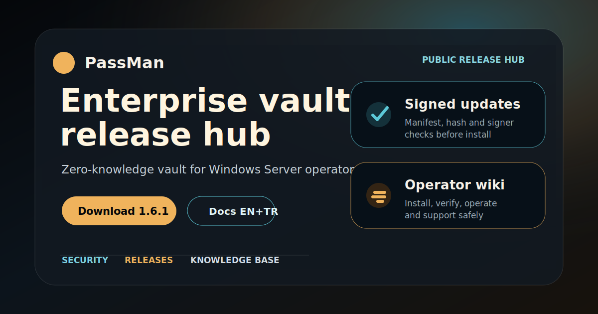
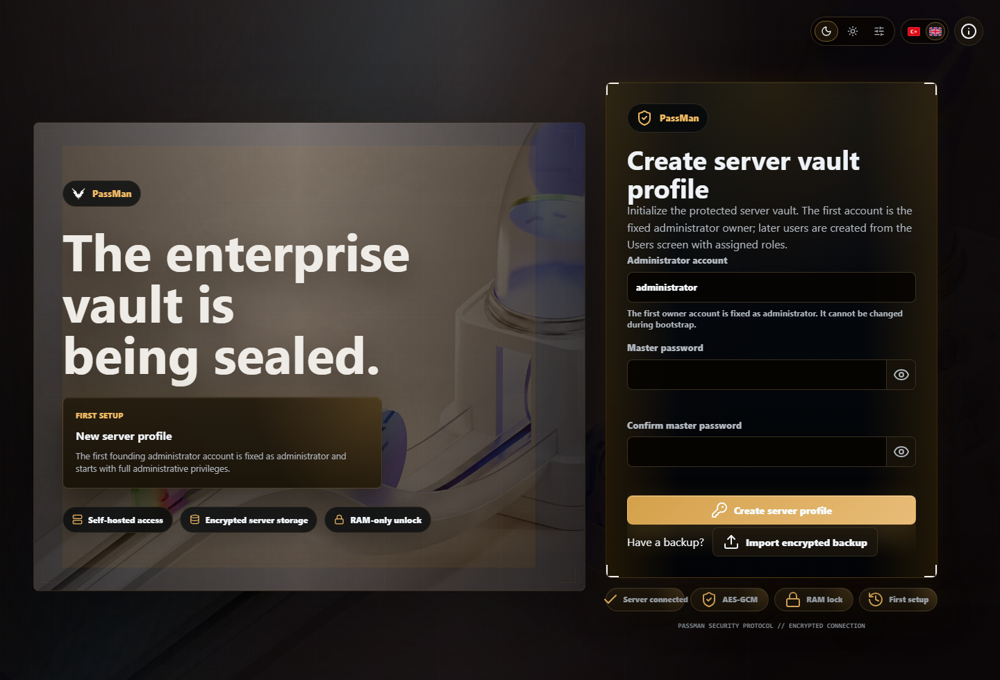
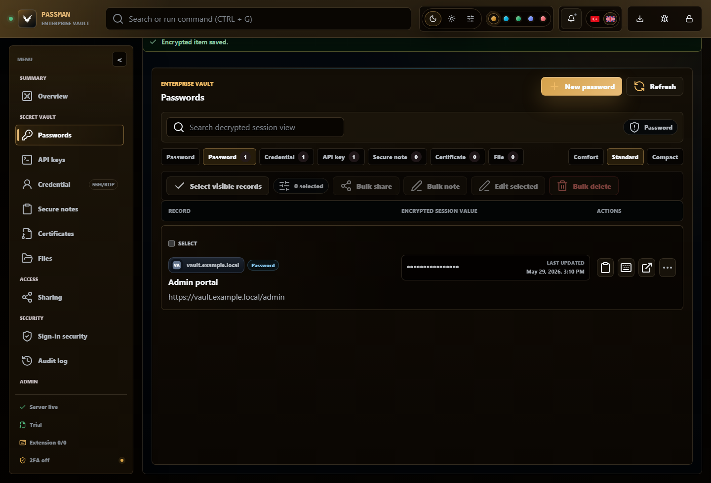
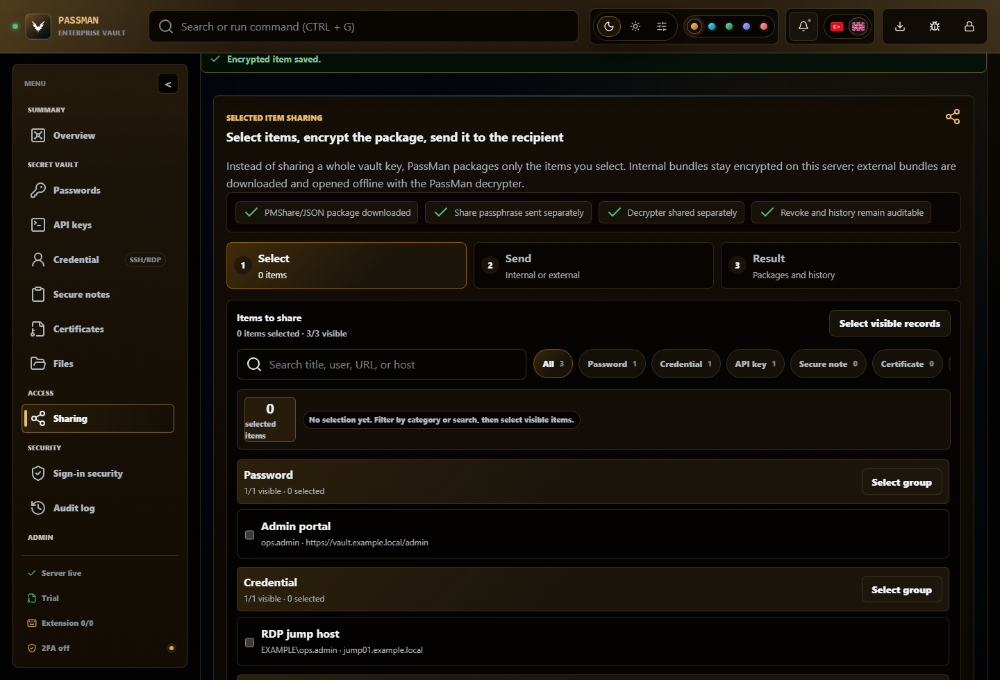
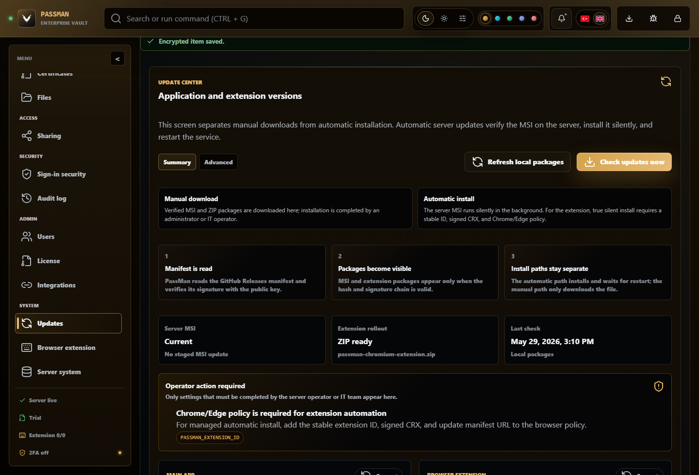
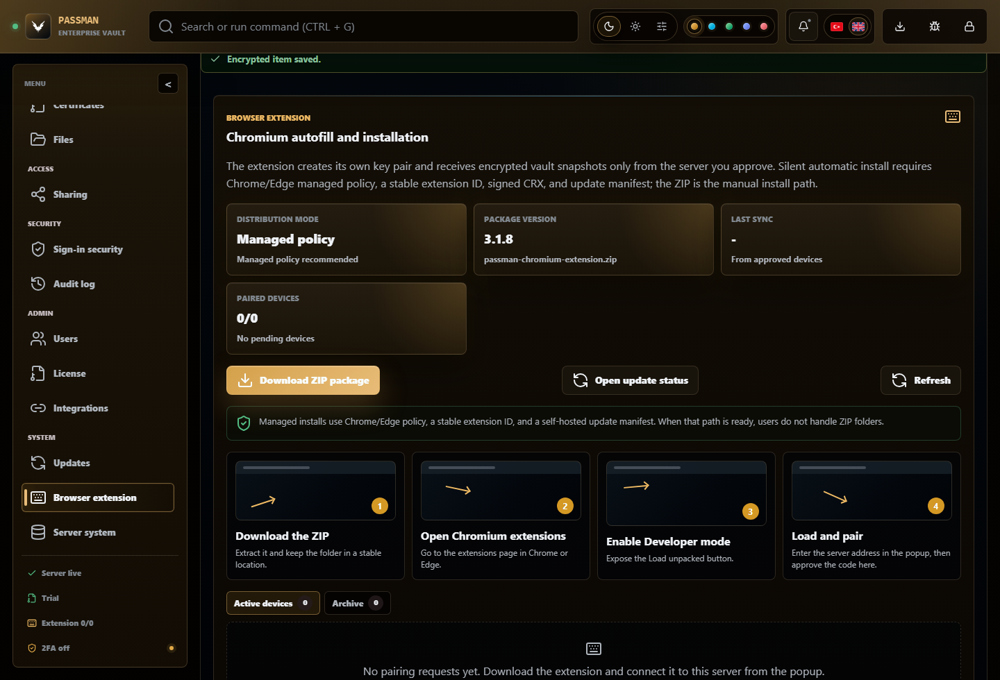
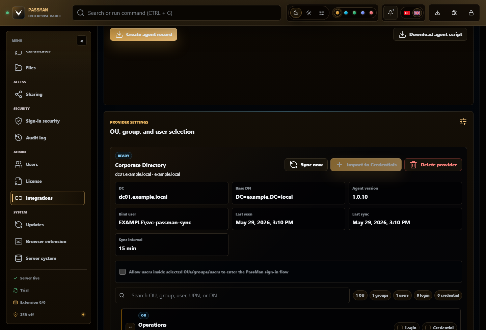
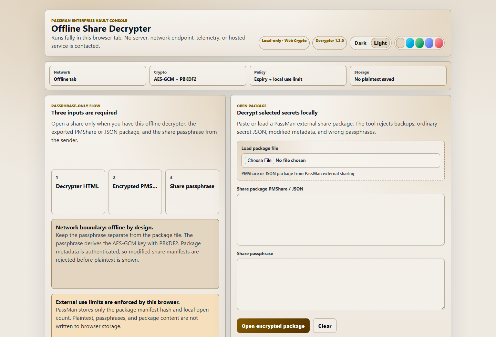

<p align="center">
  
</p>

<h1 align="center">PassMan Enterprise Vault Console</h1>

<p align="center">
  <strong>Public product hub, operator documentation, knowledge base and release center for PassMan.</strong>
</p>

<p align="center">
  <a href="https://github.com/ucsahinn/passman-releases/releases/latest"><strong>Latest Release</strong></a>
  |
  <a href="docs/en/README.md"><strong>Docs EN</strong></a>
  |
  <a href="docs/tr/README.md"><strong>Docs TR</strong></a>
  |
  <a href="kb/en/README.md"><strong>KB EN</strong></a>
  |
  <a href="kb/tr/README.md"><strong>KB TR</strong></a>
  |
  <a href="SECURITY.md"><strong>Security</strong></a>
  |
  <a href="SUPPORT.md"><strong>Support</strong></a>
</p>

<p align="center">
  <code>Stable 1.6.0</code>
  &nbsp;
  <code>Windows MSI</code>
  &nbsp;
  <code>TR + EN</code>
  &nbsp;
  <code>Self-hosted</code>
  &nbsp;
  <code>Source private</code>
</p>

---


## Start Here

Use this repository as the front desk for PassMan. It should answer the first operational question without exposing source code, secrets, signing material or customer data.

| I need to... | Open this | Outcome |
| --- | --- | --- |
| Take the shortest safe path from download to first healthy vault | [EN admin quickstart](docs/en/admin-quickstart.md) / [TR hızlı başlangıç](docs/tr/admin-quickstart.md) | Day-0 install, owner, license, HTTPS, 2FA and backup are sequenced. |
| Run PassMan after go-live | [EN operator runbook](docs/en/operator-runbook.md) / [TR operasyon runbook](docs/tr/operator-runbook.md) | Daily, weekly, monthly and incident routines are clear. |
| Install PassMan on Windows Server | [EN install](docs/en/install-windows-server.md) / [TR kurulum](docs/tr/install-windows-server.md) | MSI installed, service running, first URL verified. |
| Create the first owner and apply license | [EN first run](docs/en/first-run-owner-license.md) / [TR ilk kurulum](docs/tr/first-run-owner-license.md) | Owner profile, license state and first vault path are clear. |
| Configure public host and HTTPS | [EN HTTPS](docs/en/public-host-https-certificate.md) / [TR HTTPS](docs/tr/public-host-https-certificate.md) | Required certificate package and browser validation are understood. |
| Fix an operational issue | [EN knowledge base](kb/en/README.md) / [TR bilgi bankası](kb/tr/README.md) | Safe evidence and diagnosis path are available. |
| Update PassMan or verify release assets | [EN release asset verification](docs/en/release-asset-verification.md) / [TR asset doğrulama](docs/tr/release-asset-verification.md) | Manifest, checksum, MSI signer and component notes are verified. |
| Pair or troubleshoot the browser extension | [EN extension](docs/en/browser-extension.md) / [TR eklenti](docs/tr/browser-extension.md) | Badge count, autofill, save/update login and device pairing behavior are clear. |
| Sync Active Directory | [EN DC Agent](docs/en/active-directory-agent.md) / [TR DC Agent](docs/tr/active-directory-agent.md) | Service install, repair, logs and OU tree sync are documented. |
| Open or diagnose external shares | [EN sharing](docs/en/sharing-and-offline-decrypter.md) / [TR paylasim](docs/tr/sharing-and-offline-decrypter.md) | Selected records, files, expiry, max opens and offline decrypter flow are clear. |
| Prepare a clean support handoff | [EN support evidence pack](docs/en/support-evidence-pack.md) / [TR destek kanıt paketi](docs/tr/support-evidence-pack.md) | Operators know exactly what to collect and what never to send. |

## Enterprise Wiki Map


| Role | Primary path | Decision point |
| --- | --- | --- |
| Server administrator | [Quickstart](docs/en/admin-quickstart.md), [installation](docs/en/install-windows-server.md), [public host and HTTPS](docs/en/public-host-https-certificate.md) | Is the Windows service reachable, signed and backed up? |
| Security owner | [Security model](docs/en/security-and-trust-model.md), [audit posture](docs/en/audit-and-security-posture.md), [release verification](docs/en/release-asset-verification.md) | Are secrets encrypted before storage and are updates trusted by manifest plus hash? |
| Support engineer | [Support evidence pack](docs/en/support-evidence-pack.md), [troubleshooting](docs/en/troubleshooting.md), [KB](kb/en/README.md) | Can the issue be reproduced with redacted evidence only? |
| Identity operator | [DC Agent](docs/en/active-directory-agent.md), [extension](docs/en/browser-extension.md), [operator runbook](docs/en/operator-runbook.md) | Are AD sync, browser pairing and user scope healthy? |
| Turkish operator | [TR hızlı başlangıç](docs/tr/admin-quickstart.md), [TR runbook](docs/tr/operator-runbook.md), [TR bilgi bankası](kb/tr/README.md) | Aynı operasyon yolu Türkçe doküman setinde izlenir. |

## What This Repository Is

This is the public GitHub home for PassMan Enterprise Vault Console. It contains customer-safe documentation, how-to guides, knowledge-base articles, sanitized product screenshots, release notes and links to GitHub Release assets.

This repository does not contain private source code, license issuer material, update signing private keys, customer data, databases, backups, certificates or release binaries committed into git.

## Product Snapshot

| Area | Operator value |
| --- | --- |
| Enterprise vault console | Passwords, API keys, credentials, secure notes, certificates and file-backed secrets in one self-hosted console. |
| Zero-knowledge model | Secret payloads are encrypted before storage; unlock material stays in the active browser session. |
| Security posture | 2FA, audit chain, extension health, license state, update status and priority actions are visible from the overview. |
| Selected sharing | Only selected records and files are packaged; operators set expiry, maximum opens and recipient handling. |
| Browser extension | Pairing, active-site record count, autofill, save-login and update-login prompts for paired devices. |
| Directory integration | PassMan DC Agent Service runs as a Windows service and syncs AD OU, group, user and computer metadata without collecting AD password values. |
| Operations | Offline licensing, signed updates, backups, diagnostics, HTTPS certificate upload and support-safe logs. |

## Operator Path

1. Download the latest MSI from GitHub Releases.
2. Install it as Administrator on the approved Windows host.
3. Open `http://<SERVER_HOST>:1903`, create the owner profile and unlock the vault.
4. Apply the license and configure public host plus HTTPS.
5. Enable 2FA, confirm audit-chain health and review the overview action queue.
6. Pair the Chromium extension for approved browsers.
7. Configure PassMan DC Agent Service if AD scope is needed.
8. Review backup, restore, update and support-evidence procedures.

## Current Release Assets

| Asset | Purpose | Delivery |
| --- | --- | --- |
| [PassMan-1.6.0-x64.msi](https://github.com/ucsahinn/passman-releases/releases/latest/download/PassMan-1.6.0-x64.msi) | Installs or upgrades PassMan Server on Windows. | GitHub Release |
| [passman-update.json](https://github.com/ucsahinn/passman-releases/releases/latest/download/passman-update.json) | Signed update manifest verified by PassMan. | GitHub Release |
| [passman-chromium-extension.zip](https://github.com/ucsahinn/passman-releases/releases/latest/download/passman-chromium-extension.zip) | Browser extension fallback package. | GitHub Release |
| [passman-share-decrypter.zip](https://github.com/ucsahinn/passman-releases/releases/latest/download/passman-share-decrypter.zip) | Offline external-share opening tool. | GitHub Release |
| [passman-ad-agent.ps1](https://github.com/ucsahinn/passman-releases/releases/latest/download/passman-ad-agent.ps1) | PassMan DC Agent Service installer and repair script. | GitHub Release |

PassMan-managed updates verify the signed manifest, release asset metadata, SHA-256 checksum and MSI signer thumbprint before starting the MSI flow. A global CA chain is not required for PassMan-managed update trust when the signed manifest pins the local release signer thumbprint. CA-backed or trusted-signing certificates remain recommended for Windows reputation and broad OS-level trust.

## Component Versions

| Component | Version | Update path |
| --- | ---: | --- |
| PassMan Enterprise Vault Console | 1.6.0 | Windows MSI / Update Center |
| Chromium Browser Extension | 1.3.1 | Managed rollout or ZIP fallback |
| Offline Share Decrypter | 1.2.0 | Bundled support component and release ZIP |
| PassMan DC Agent Service | 1.1.0 | Bundled support component and release script |

## Documentation Gateway

| Area | English | Turkish |
| --- | --- | --- |
| Language home | [EN docs home](docs/en/README.md) | [TR doküman ana sayfa](docs/tr/README.md) |
| Admin quickstart | [Admin quickstart](docs/en/admin-quickstart.md) | [Yönetici hızlı başlangıç](docs/tr/admin-quickstart.md) |
| Operator runbook | [Operator runbook](docs/en/operator-runbook.md) | [Operasyon runbook](docs/tr/operator-runbook.md) |
| Overview | [Overview](docs/en/overview.md) | [Genel bakış](docs/tr/overview.md) |
| Security model | [Security and trust model](docs/en/security-and-trust-model.md) | [Güvenlik ve güven modeli](docs/tr/security-and-trust-model.md) |
| Install | [Windows Server installation](docs/en/install-windows-server.md) | [Windows Server kurulumu](docs/tr/install-windows-server.md) |
| First run and license | [First run, owner and license](docs/en/first-run-owner-license.md) | [İlk kurulum, owner ve lisans](docs/tr/first-run-owner-license.md) |
| Public host and HTTPS | [Public host and HTTPS](docs/en/public-host-https-certificate.md) | [Public host ve HTTPS](docs/tr/public-host-https-certificate.md) |
| Update Center | [Update Center](docs/en/update-center.md) | [Güncelleme Merkezi](docs/tr/update-center.md) |
| Release asset verification | [Release asset verification](docs/en/release-asset-verification.md) | [Release asset doğrulama](docs/tr/release-asset-verification.md) |
| Browser extension | [Browser extension](docs/en/browser-extension.md) | [Tarayıcı eklentisi](docs/tr/browser-extension.md) |
| Active Directory agent | [Active Directory agent](docs/en/active-directory-agent.md) | [Active Directory ajanı](docs/tr/active-directory-agent.md) |
| Sharing and decrypter | [Sharing and offline decrypter](docs/en/sharing-and-offline-decrypter.md) | [Paylaşım ve offline decrypter](docs/tr/sharing-and-offline-decrypter.md) |
| Backups and restore | [Backups and restore](docs/en/backups-and-restore.md) | [Yedekleme ve geri yükleme](docs/tr/backups-and-restore.md) |
| Audit and posture | [Audit and security posture](docs/en/audit-and-security-posture.md) | [Denetim ve güvenlik duruşu](docs/tr/audit-and-security-posture.md) |
| Troubleshooting | [Troubleshooting](docs/en/troubleshooting.md) | [Sorun giderme](docs/tr/troubleshooting.md) |
| Support evidence pack | [Support evidence pack](docs/en/support-evidence-pack.md) | [Destek kanıt paketi](docs/tr/support-evidence-pack.md) |
| FAQ | [FAQ](docs/en/faq.md) | [SSS](docs/tr/faq.md) |

## Knowledge Base Gateway

| Incident | English | Turkish |
| --- | --- | --- |
| MSI installation fails | [EN](kb/en/msi-installation-fails.md) | [TR](kb/tr/msi-installation-fails.md) |
| Update stays around 76 percent | [EN](kb/en/update-stuck-76.md) | [TR](kb/tr/update-stuck-76.md) |
| DC Agent service cannot connect | [EN](kb/en/dc-agent-service.md) | [TR](kb/tr/dc-agent-service.md) |
| Extension pairing remains pending | [EN](kb/en/extension-pairing.md) | [TR](kb/tr/extension-pairing.md) |
| Certificate warning | [EN](kb/en/certificate-warning.md) | [TR](kb/tr/certificate-warning.md) |
| Audit chain is partial | [EN](kb/en/audit-chain-partial.md) | [TR](kb/tr/audit-chain-partial.md) |
| License is read-only | [EN](kb/en/license-read-only.md) | [TR](kb/tr/license-read-only.md) |
| External share package fails | [EN](kb/en/external-share-fails.md) | [TR](kb/tr/external-share-fails.md) |
| Login creates 401 or 403 noise after unlock | [EN](kb/en/session-401-after-login.md) | [TR](kb/tr/session-401-after-login.md) |

## Product Walkthrough

All screenshots are captured from the actual PassMan application with sanitized demo data.

<details open>
<summary>Core console surfaces</summary>

| Surface | Screenshot |
| --- | --- |
| Login / lock screen |  |
| Security posture overview |  |
| Password record list |  |
| Sharing package flow |  |

</details>

<details>
<summary>Operations and support surfaces</summary>

| Surface | Screenshot |
| --- | --- |
| Update Center |  |
| Browser extension management |  |
| Active Directory sync tree |  |
| Offline share decrypter |  |

</details>

## Public Safety Boundary

Never upload or paste these materials into this repository, public issues, comments or support threads:

- Plaintext secrets, passwords, share passphrases or vault contents.
- AD bind passwords, agent tokens, license private keys or update signing private keys.
- Databases, backups, PFX/P12 files, private keys or logs with sensitive values.
- Screenshots showing real secret records, users, customer URLs or internal infrastructure.

Use placeholders such as `<PASSMAN_URL>`, `<SERVER_HOST>`, `<AGENT_ID>`, `<AGENT_TOKEN>` and `<LICENSE_CODE>` in public examples.

## Repository Validation

Run before publishing public documentation changes:

```powershell
npm run validate
```

The validation checks local links, TR/EN doc parity, required visual assets, real screenshots, stale release wording, forbidden public-site leftovers, large release binaries, secret-like public patterns and encoding artifacts.
